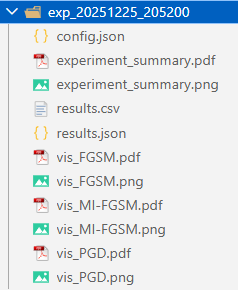
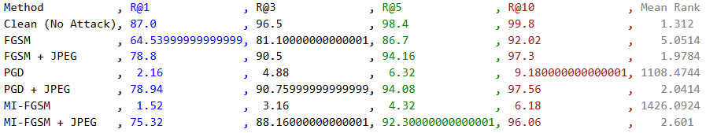
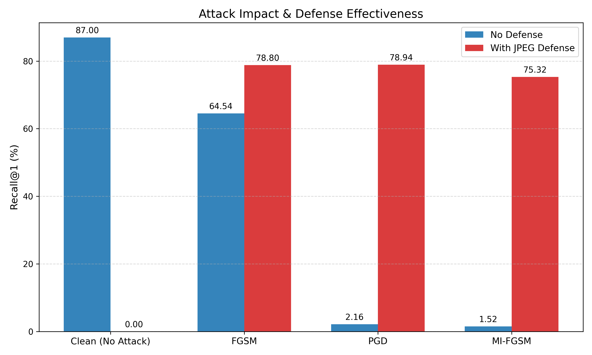
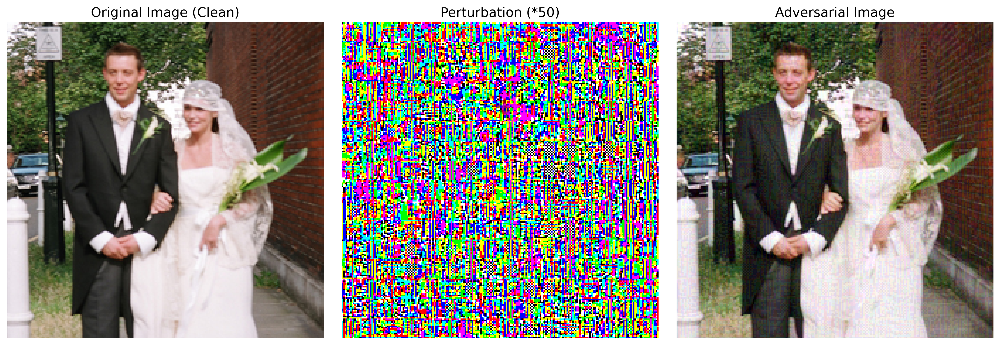
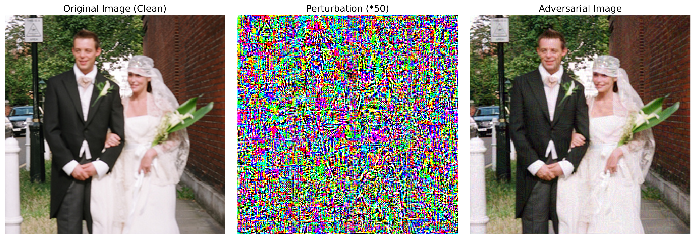
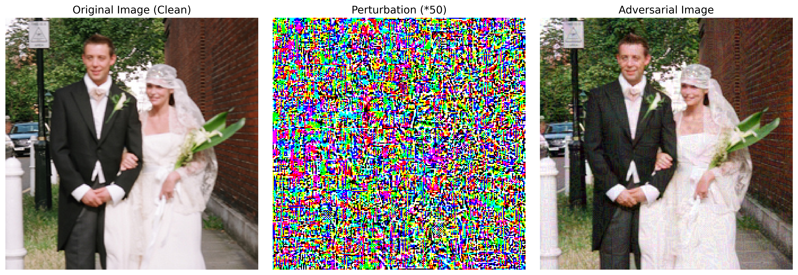
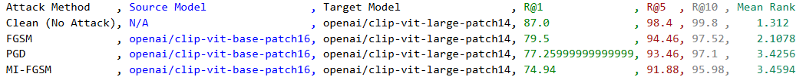

# 环境配置及使用说明文档

## 项目简介

本项目是一个针对CLIP多模态模型的对抗攻击与防御实验系统。系统实现了多种对抗攻击方法（FGSM、PGD、MI-FGSM）和JPEG压缩防御机制，并支持攻击迁移性评估实验。

### 主要功能

- **对抗攻击**：实现FGSM、PGD、MI-FGSM三种经典对抗攻击算法
- **防御机制**：JPEG压缩防御，可配置压缩质量
- **迁移性评估**：评估攻击在不同CLIP模型间的迁移效果
- **检索评估**：基于Recall@K和Mean Rank的全局图像-文本检索评估
- **可视化**：自动生成攻击效果对比图和性能对比图表

---

## 目录结构

```
src/
├── main.py                        # 主实验程序（攻击+防御）
├── transfer_main.py               # 迁移性实验程序
├── environment.yml                # Conda 环境配置文件
├── config/                        # 配置文件目录
│   ├── algorithm_config.py        # 攻击算法配置 (FGSM/PGD/MI-FGSM)
│   ├── eval_dataset_config.py     # 评估数据集配置
│   └── transfer_dataset_config.py # 迁移实验数据集配置
├── utils/                         # 工具函数目录
│   ├── dataset.py                 # 数据集加载器
│   ├── attacker.py                # 对抗攻击实现 (MultimodalAttacker)
│   ├── defence.py                 # 并行 JPEG 防御实现
│   └── utils.py                   # 检索指标 (Recall@K) 计算与可视化工具
├── data/                          # 数据目录 (已准备好)
│   ├── flickr1k_test_images/      # 测试图像目录
│   ├── results.csv                # 标注文件
│   └── test.txt                   # 测试集白名单
└── results/                       # 实验结果自动输出目录
```

---

## 环境配置

### 系统要求

- **操作系统**：Linux / Windows
- **Python版本**：Python 3.10.19
- **CUDA**：建议CUDA 12.4+
- **内存**：建议16GB+
- **显存**：建议8GB+

### 使用Conda环境安装依赖

#### 1. 安装Conda

如果尚未安装Conda，请访问 [Anaconda官网](https://www.anaconda.com/download) 或 [Miniconda官网](https://docs.conda.io/en/latest/miniconda.html) 下载并安装。

#### 2. 创建环境

```bash
# 使用environment.yml创建环境
conda env create -f environment.yml

# 激活环境
conda activate multi-attacker
```

#### 3. <a id="HF">配置HuggingFace镜像</a>

为保证正常从HuggingFace官网下载CLIP预训练权重，需配置HuggingFace镜像

```bash
# Windows PowerShell
$env:HF_ENDPOINT="https://hf-mirror.com"

# Linux/Mac
export HF_ENDPOINT="https://hf-mirror.com"
```

---

## 数据集说明

### Flickr30k数据集

项目使用Flickr30k的测试集进行实验，共1000个样本，数据集包含图像和对应的文本描述。项目中已包含完整的测试集。

> **提示**：为节约复现校验的时间，默认配置中使用的样本数量为50。如需在完整数据集上运行实验，可在[数据集配置](#数据集配置)部分修改 `max_samples` 参数（设置为 `None` 表示使用全部1000个样本）。

### 数据集结构

```
data/
├── flickr1k_test_images/          # 图像目录
│   ├── 1000092795.jpg
│   ├── 10002456.jpg
│   └── ...
├── results.csv                    # 标注文件，格式：image_name | comment
└── test.txt                       # 测试集split（每行一个图片ID，不含扩展名）
```

---

## 使用方法

###  主实验：对抗攻击与防御评估

运行主实验程序，评估不同攻击方法的效果以及JPEG防御的有效性。

#### 基本用法

```bash
python main.py
```

**注意**：首次运行时会自动从HuggingFace下载CLIP预训练权重，根据网络情况可能需要较长时间（通常几分钟到十几分钟）。下载完成后，模型权重会缓存在本地，后续运行无需重新下载。

#### 参数说明

```bash
python main.py --model <模型名称> --jpeg_quality <压缩质量>
```

**参数详解**：

- `--model`：CLIP模型名称（默认：`clip-vit-large-patch14`）
  - 可选值：
    - `clip-vit-base-patch32`
    - `clip-vit-base-patch16`
    - `clip-vit-large-patch14`
    - `clip-vit-large-patch14-336`
  
- `--jpeg_quality`：JPEG压缩质量（默认：50）
  - 范围：1-100
  - 值越小，压缩越强，防御效果可能更好但图像质量下降

#### 示例

```bash
# 使用默认设置
python main.py

# 使用base模型，JPEG质量75
python main.py --model clip-vit-base-patch16 --jpeg_quality 75

```

#### <a id="数据集配置">数据集配置</a>

编辑 `config/eval_dataset_config.py` 修改数据集设置：

```python
dataset_config = {
    "dataset_root": r"data/flickr1k_test_images",  # 图像根目录
    "ann_file": r"data/results.csv",               # 标注文件路径
    "max_samples": 50,                             # 最大样本数（None表示全部）
    "whitelist_path": "data/test.txt",             # 白名单文件路径
    "batch_size": 16,                              # 批次大小
}
```

**配置说明**：
- `max_samples`：限制使用的样本数量。设置为 `None` 表示使用全部数据（1k测试集）。当前设置为较小值（50）是为了**节约实验时间**，如果想在完整的1k测试集上运行实验，请将 `max_samples` 设置为 `None`。

#### 输出结果

实验完成后，结果保存在 `results/exp_YYYYMMDD_HHMMSS/` 目录，目录结构如下：

  

- `config.json`：实验配置信息
- `results.csv`：评估指标（Recall@1, Recall@3, Recall@5, Recall@10, Mean Rank），如下图所示：

 

- `results.json`：详细结果（包含样本案例）

- `experiment_summary.png/pdf`：性能对比图表

     

- `vis_FGSM.png/pdf`：FGSM攻击可视化

   

- `vis_PGD.png/pdf`：PGD攻击可视化

   

- `vis_MI-FGSM.png/pdf`：MI-FGSM攻击可视化

   

### 迁移性实验：跨模型攻击评估

评估在一个模型上生成的对抗样本对另一个模型的攻击效果。

#### 基本用法

```bash
python transfer_main.py
```

**注意**：首次运行时会自动从HuggingFace下载CLIP预训练权重（包括源模型和目标模型），根据网络情况可能需要较长时间。下载完成后，模型权重会缓存在本地，后续运行无需重新下载。

#### 参数说明

```bash
python transfer_main.py --source_model <源模型> --target_model <目标模型>
```

**参数详解**：

- `--source_model`：源模型名称（默认：`clip-vit-base-patch16`）
  - 可选值：
    - `clip-vit-base-patch32`
    - `clip-vit-base-patch16`
    - `clip-vit-large-patch14`
    - `clip-vit-large-patch14-336`
  - 源模型用于生成对抗样本（白盒攻击）

- `--target_model`：目标模型名称（默认：`clip-vit-large-patch14`）
  - 可选值同上
  - 目标模型用于评估迁移效果

#### 使用示例

```bash
# 使用默认设置（base-patch16 -> large-patch14）
python transfer_main.py

# 指定源模型和目标模型
python transfer_main.py --source_model clip-vit-base-patch16 --target_model clip-vit-large-patch14

# 使用base模型作为源和目标
python transfer_main.py --source_model clip-vit-base-patch32 --target_model clip-vit-base-patch16
```

#### 数据集配置

迁移性实验的数据集配置与主实验相同，配置文件位于 `config/transfer_dataset_config.py`。默认 `max_samples` 设置为 50 是为了节约时间，如需在完整1k测试集上运行，请将 `max_samples` 设置为 `None`。

#### 输出结果

结果保存在 `results/transfer_exp_YYYYMMDD_HHMMSS/` 目录：

- `config.json`：实验配置（包含源模型、目标模型、攻击配置、数据集配置）
- `transfer_results.csv`：迁移性评估结果（包含各攻击方法的R@1, R@5, R@10, Mean Rank）

 

#### 注意事项

1. **模型选择**：源模型用于生成对抗样本（白盒攻击），目标模型用于评估迁移效果（黑盒评估）。

2. **批次大小**：如果遇到CUDA内存不足，可以减小 `config/transfer_dataset_config.py` 中的 `batch_size`。

---

## 评估指标说明

### Recall@K (R@K)

Recall@K表示在检索结果的前K个候选中，至少包含一个正确匹配的比例。

- **R@1**：Top-1检索准确率
- **R@5**：Top-5检索准确率
- **R@10**：Top-10检索准确率

### Mean Rank (MR)

Mean Rank表示正确匹配文本在所有候选文本中的平均排名。

---

## 常见问题

### CUDA内存不足

**问题**：`RuntimeError: CUDA out of memory`

**解决方案**：
- 减小`batch_size`
- 使用较小的模型（如`clip-vit-base-patch16`）
- 设置`max_samples`限制数据量
- 使用CPU模式（将代码中的`device`改为`"cpu"`）

### HuggingFace模型下载失败

**问题**：模型下载超时或失败

**解决方案**：

- 确认已设置`HF_ENDPOINT`环境变量：[配置HuggingFace镜像](#HF)
- 手动下载模型到本地，修改代码使用本地路径
- 检查网络连接

---


## 代码结构说明

### 核心模块

1. **dataset.py**：数据集加载器
   - `LocalFlickrDataset`：本地Flickr30k数据集加载
   - `DifferentiableNormalize`：可微归一化层（用于攻击）

2. **attacker.py**：对抗攻击实现
   - `MultimodalAttacker`：多模态攻击器
   - `mi_fgsm_attack`：通用攻击方法（支持FGSM/PGD/MI-FGSM）

3. **defence.py**：防御机制
   - `jpeg_compress_defense`：单张图像JPEG压缩
   - `batch_jpeg_compress_defense`：批量JPEG压缩（并行优化）

4. **utils.py**：工具函数
   - `evaluate_global_retrieval`：全局检索评估
   - `visualize_attack_result`：攻击效果可视化
   - `plot_performance_comparison`：性能对比图表

---

## 实验流程

### 主实验流程

1. **初始化**：设置随机种子，创建实验目录
2. **加载数据**：读取Flickr30k数据集和标注
3. **加载模型**：加载CLIP模型和处理器
4. **Phase 1**：评估干净图像的检索性能（Baseline）
5. **Phase 2**：对每种攻击方法：
   - 生成对抗样本
   - 应用JPEG防御
   - 评估攻击和防御后的检索性能
6. **保存结果**：保存CSV、JSON和可视化图表

### 迁移性实验流程

1. **初始化**：设置随机种子，创建实验目录
2. **加载数据**：读取数据集
3. **加载模型**：加载Source和Target模型
4. **Phase A**：使用Target模型建立文本索引库
5. **Phase B**：评估干净图像在Target模型上的性能
6. **Phase C**：在Source模型上生成对抗样本，在Target模型上评估迁移效果
7. **保存结果**：保存迁移性评估结果

---
